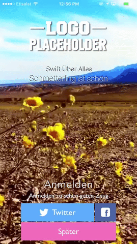
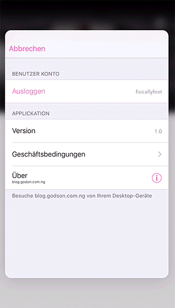

# IOS Swift Boiler Plate with Authentication

A boiler plate written in Swift 2.2 with _Facebook_ and _Twitter_ Authentication.

[![Swift Version][swift-image]][swift-url]
[![License][license-image]][license-url]
 

### Package Manager
The packages are staged as recommended to avoid framework support deprecation.
 - [CocoaPods](https://cocoapods.org)

### Frameworks used
 - [CocoaPods](./Podfile)
    - [Alamofire](https://github.com/Alamofire/Alamofire)
    - [SwiftyJSON](https://github.com/SwiftyJSON/SwiftyJSON)
 - Facebook SDK (Core and Login)

### Localization
English :us: and German :de: are supported by the application, in _Localizable.strings_ and in the Storyboard's language files.

### CoreData Entities
 - [Users](./IOSSwiftBoiler/Users.swift)
    - _name_: `String`
    - _platform_: `String`
    - _email_: `String`
    - _user_id_: `String`
    - _img_: `String`
    - _oauth_token_: `String`
    - _oauth_token_secret_: `String`
    - _bg_img_: `String`
    - _username_: `String`
    - _desc_: `String`

### Twitter and Facebook API keys
The Facebook _APP\_ID_ can be found in [LoginViewController.swift](./IOSSwiftBoiler/LoginViewController.swift) in line _237_.

Both Twitter and Facebook employ the Social.framework built into Xcode.

### How to use
After launch, the application tries to get the user from the `Users` entity. If the user exists a View is displayed, and vice-versa.

The currently logged in user is saved as a JSON object as `Helpers.currentUser`, where `Helpers` is a singleton.

On successful authentication, the user is redirected to the _HomeViewController_ which now displays the user's profile details, and saves the user in the CoreData _Users_ entity.

### Perks
 - 3D Touch for context menu
 - Settings View Controller.

### Previews
#### HomeViewController (not logged in)
  

-------

#### LoginViewControllers

The background video is located [here](./IOSSwiftBoiler/Assets/background.mp4)

-------

#### HomeViewController (logged in)

-------

#### SettingsViewController

-------

#### 3D Touch
 

-------

The MIT License (MIT). Please see [License File](LICENSE.md) for more information.

[swift-image]:https://img.shields.io/badge/swift-2.2-orange.svg
[swift-url]: https://swift.org/
[license-image]: https://img.shields.io/badge/License-MIT-blue.svg
[license-url]: LICENSE.md